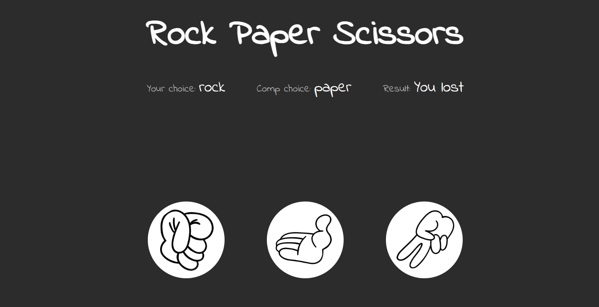

# Rock Paper Scissors Game

Welcome to the Rock Paper Scissors game! This is a classic game that pits you against the computer in a battle of wits and strategy. Are you ready to challenge your luck and see if you can outsmart your opponent?

## Introduction

Rock Paper Scissors is a simple yet entertaining game played around the world. It requires no special equipment or skills, making it accessible to everyone. In this digital version of the game, you'll be facing off against the computer in a series of rounds to determine who reigns supreme.

## How to Play

1. **Open the HTML file**: Start by opening the provided HTML file in your web browser.
2. **Make Your Choice**: You'll see three buttons labeled "Rock," "Paper," and "Scissors." Click on the button corresponding to the option you want to choose.
3. **Computer's Turn**: After you make your choice, the computer will randomly select its own option.
4. **Determine the Winner**: The game will compare your choice with the computer's choice and declare a winner for that round.
5. **Repeat**: You can play as many rounds as you like to see if you can beat the computer.

## Have Fun!

Now that you know the rules, it's time to jump in and start playing. Whether you're looking to pass the time or engage in some friendly competition, Rock Paper Scissors is sure to provide entertainment for players of all ages. So go ahead, make your choice, and let the games begin!
